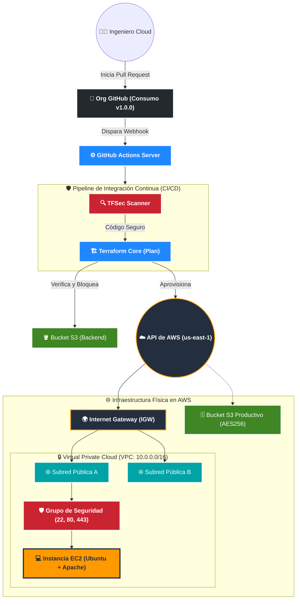

<div align="center">
  
  
  
  
  
</div>

<br>

# ☁️ Arquitectura DevSecOps de Orquestación e Infraestructura Unificada

Este repositorio centraliza y coordina el aprovisionamiento de la topología completa en la nube sobre Amazon Web Services (AWS) mediante la integración de un pipeline robusto de **Integración Continua (CI/CD)** y **Políticas de Seguridad Automatizadas (Policy as Code)**.

## 🏛️ Topología de Arquitectura DevSecOps

El siguiente diagrama ilustra la interconexión de nuestro ecosistema. Abarca desde la orquestación del código y escaneos de seguridad automatizados en GitHub, hasta el aprovisionamiento de la infraestructura física en AWS.



### 📋 Leyenda de Componentes
| Logo / Símbolo | Componente Técnico | Función en la Arquitectura |
| :---: | :--- | :--- |
| 🐙 | **GitHub Org** | Orquestador de código y host de módulos (VPC, EC2, S3) bajo *SemVer*. |
| ⚙️ | **GitHub Actions** | Servidor virtual temporal (`ubuntu-latest`) que ejecuta el pipeline. |
| 🔍 | **TFSec** | Barrera de seguridad *Policy as Code*. Bloquea código vulnerable. |
| 🪣 | **Backend S3** | Almacenamiento seguro del estado de Terraform para prevenir *Drift*. |
| ☁️ | **AWS Cloud** | Proveedor de infraestructura física para recursos de red y cómputo. |
| 💻 | **EC2** | Servidor de aplicaciones web aprovisionado automáticamente. |

---


## 🏗️ Gestión de Módulos mediante Versionado Semántico (SemVer)

Para mitigar riesgos de ruptura estructural en producción y garantizar compatibilidad hacia atrás, este repositorio principal no consume el código de manera dinámica desde las ramas principales de desarrollo. En su lugar, consume los módulos alojados en la organización externa utilizando *Git Tags* rígidos y precisos:

```hcl
module "networking" {
  source   = "git::[https://github.com/BPainemilla-IaC-Org/terraform-aws-vpc-module.git?ref=v1.0.0](https://github.com/BPainemilla-IaC-Org/terraform-aws-vpc-module.git?ref=v1.0.0)"
  vpc_name = var.vpc_name
  # ... variables de entorno
}

module "compute" {
  source   = "git::[https://github.com/BPainemilla-IaC-Org/terraform-aws-ec2-module.git?ref=v1.0.0](https://github.com/BPainemilla-IaC-Org/terraform-aws-ec2-module.git?ref=v1.0.0)"
  subnet_id = module.networking.subnet_public_a_id
}

module "storage" {
  source   = "git::[https://github.com/BPainemilla-IaC-Org/terraform-aws-s3-module.git?ref=v1.0.0](https://github.com/BPainemilla-IaC-Org/terraform-aws-s3-module.git?ref=v1.0.0)"
}
```

---

## 🛡️ Características del Pipeline CI/CD (GitHub Actions)

El archivo de configuración `.github/workflows/terraform-ci.yml` actúa como nuestro sistema de permisos e integridad operativa:

1. **Protección de Ramas Primarias:** Se prohíben explícitamente los *pushes* y modificaciones directas hacia la rama `main`. Todo cambio estructural se ve obligado a canalizarse a través de una rama paralela (*feature branch*).
2. **Calidad de Código y Estructuras (`terraform fmt`):** El pipeline ejecuta un chequeo estricto del formato formal. Si los archivos presentan inconsistencias de indentación o legibilidad, el pipeline aborta, garantizando código homogéneo.
3. **Análisis Estático de Seguridad (`TFSec`):** Escanea los manifiestos de Terraform buscando malas configuraciones arquitectónicas (como Security Groups con puertos abiertos globalmente hacia Internet) antes de interactuar con AWS, protegiendo los activos en la nube de accesos maliciosos.
4. **Backend Remoto Seguro:** La persistencia del archivo de estado (`terraform.tfstate`) se gestiona remotamente dentro de un bucket S3 protegido, garantizando concurrencia, encriptación y soporte ante catástrofes

## 🚀 Despliegue y Reproducción (Pasos Operativos)

### Requisitos Previos
* Terraform versión `>= 1.9.0`.
* Credenciales de AWS configuradas de forma local y en los secretos de GitHub Actions (`AWS_ACCESS_KEY_ID`, `AWS_SECRET_ACCESS_KEY`, `AWS_SESSION_TOKEN`).

### Fase 0: Preparación del Backend Remoto
Dado que esta arquitectura utiliza un backend remoto en S3 para proteger el archivo de estado y evitar desincronizaciones (*drift*), el bucket contenedor debe ser provisionado de manera manual o mediante CLI **antes** de inicializar Terraform.

Ejecute el siguiente comando en su terminal para crear el bucket del backend:
```bash
aws s3 mb s3://brpainemilla-terraform-state-bucket --region us-east-1
```
### Fase 1: Ciclo de Vida de Infraestructura
Una vez creado el bucket del backend, proceda con el despliegue estándar:

* 1. Inicialización: Descarga de módulos remotos y configuración del backend.
```bash
terraform init -upgrade
```
* 2. Formateo y Validación: Comprobación estricta de sintaxis y estándares.
```bash
terraform fmt
terraform validate
```
* 3. Planificación: Evaluación de estado y revisión de recursos a crear.
```bash
terraform plan
```
* 4. Aplicación: Ejecución de cambios hacia la API de AWS.
```bash
terraform apply -auto-approve
```
### Fase 2: Control de Cambios (Flujo CI/CD)
Una vez que la infraestructura base está desplegada, este repositorio prohíbe las modificaciones directas o ejecuciones manuales sobre el entorno productivo. Cualquier actualización debe seguir el flujo DevSecOps:

* 1. Ramificación: Crear una rama de característica (*feature branch*).
```bash
git checkout -b feature/actualizacion-recursos
```
* 2. Desarrollo y Commit: Aplicar los cambios en el código y registrarlos.
```bash
git add .
git commit -m "feat: actualización de parámetros de infraestructura"
git push origin feature/actualizacion-recursos
```
* 3. Pull Request: Abrir un PR en GitHub. Esto disparará automáticamente el pipeline de GitHub Actions.
* 4. Validación: El sistema ejecutará el análisis estático de seguridad (TFSec) y planificará los cambios (Terraform Plan).
* 5. Fusión (Merge): Solo si el pipeline aprueba los controles de seguridad, el código podrá integrarse a la rama principal.

### Fase 3: Destrucción del Entorno (Teardown)
Para mantener la higiene de la cuenta de AWS y evitar la facturación de recursos o el agotamiento del presupuesto del laboratorio, toda la infraestructura aprovisionada debe ser desmantelada una vez finalizadas las pruebas operativas.

Dado que la API de AWS impide la eliminación de contenedores de almacenamiento con datos residuales, el proceso de desmantelamiento consta de dos pasos obligatorios:

* 1. Purga de Datos (Script de Limpieza):
Ejecute el script automatizado para forzar el vaciado total de los objetos y versiones almacenadas en el bucket S3 productivo.
```bash
chmod +x aniqui_allcont_in_s3.sh
./aniqui_allcont_in_s3.sh
```
* 2. Destrucción de Infraestructura (IaC):
Una vez que el almacenamiento se encuentra purgado, proceda a eliminar los recursos administrados por el estado de Terraform (VPC, EC2, S3, Security Groups).

Ejecute el siguiente comando para eliminar todos los recursos administrados por Terraform:
```bash
terraform destroy -auto-approve
```
*Nota Operativa: El bucket S3 que actúa como backend remoto de Terraform (creado manualmente en la Fase 0) queda excluido de esta destrucción automatizada. Para una limpieza total de la cuenta, dicho bucket debe vaciarse y eliminarse directamente desde la CLI o consola de AWS.*
